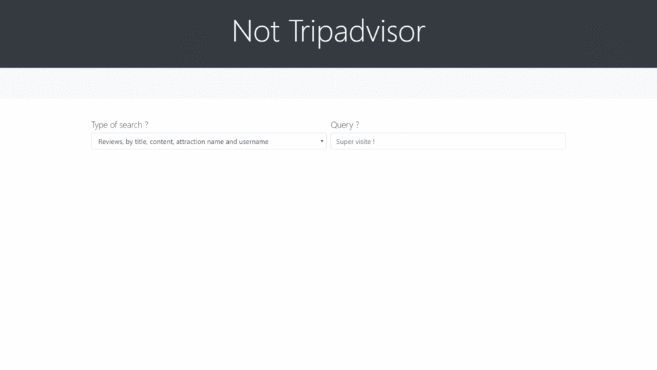

# Not Tripadvisor

This project has been developped during the course DSIA-4203C. The goal was to crawl
and scrape data from a chosen website. We decided to retrieve users and reviews from
Tripadvisor.

## Table of content
1. [Getting Started](#getting-started)  
    1.1 [Prerequisites](#prerequisites)  
    1.2 [Installing and Running](#installing-and-running)  
    1.3 [The app doesn't run ?](#the-app-doesnt-run-)
2. [User Guide](#user-guide)  
    2.1 [Home Page](#home-page)  
    2.2 [Search Page](#search-page)  
    2.3 [Graph Page](#graph-page)
3. [Reference Guide](#reference-guide)  
    3.1 [Crawling Ex Nihilo](#crawling-ex-nihilo)  
    3.2 [Why Elasticsearch ?](#why-elasticsearch-)

## Getting Started

These instructions will get you a copy of the project up and running on your local machine.

### Prerequisites

Thanks to docker's magic, it's really the only thing you need to setup *- ok, along with docker-compose*. You can install docker [here](https://docs.docker.com/install/). If you don't
fit the system requirements, don't forget to check [Docker Toolbox](https://docs.docker.com/toolbox/overview/). As for Docker Compose : [it's over here](https://docs.docker.com/compose/install/).

### Installing and Running

Clone this repository with :
```bash
$ git clone https://github.com/borisghidaglia/data-engineering.git
```

Go into the repository :
```bash
$ cd data-engineering/
```

Then, you need to download the dumped data we prepared for you, so that it can be restored
in the *mongo* container you will start. *- Make sure you have curl and unzip installed*
```bash
$ mkdir data && \
mkdir data/dump && \
cd data/dump && \
curl -o tripadvisor_dump.zip https://perso.esiee.fr/~prolonga/data/tripadvisor_dump.zip && \
unzip tripadvisor_dump.zip && \
rm tripadvisor_dump.zip && \
cd ../..
```

**If you downloaded Docker Desktop**, make sure the app is running. **You've got Docker Toolbox ?**
If the *docker-machine* isn't started yet, run :
```bash
$ docker-machine start default
```

Finally :
```bash
$ docker-compose up -d
```

Once *app, mongo, mongo_seed* and *elastic* are built and up, and after waiting for a little while, you will be able to use the app in your browser.

### The app doesn't run ?
Do not panic. Docker will help you understand what is going on by letting you access service logs like so :
```
docker-compose logs -f --tail=50 <service_name>
```
* *-f* is used to "follow" the logs as it is beeing written by the service output.  
* *--tail=30* restrict the output to the last 30 lines of the log  

As of the *<service_name>* you can use, they are : *app, elastic, mongo, mongo_seed*.  

**Tip :** if you are checking the logs for the app and you don't see the following lines, or something similar, it is probably because mongo and elastic are not done restoring the data yet.  
```
* Serving Flask app "main" (lazy loading)
* Environment: production
  WARNING: Do not use the development server in a production environment.
  Use a production WSGI server instead.
* Debug mode: on
* Running on http://0.0.0.0:5000/ (Press CTRL+C to quit)
* Restarting with stat
* Debugger is active!
* Debugger PIN: 313-098-103
```

## Built With

* [Flask](http://flask.pocoo.org/) - Web framework, with API views for easier communication with clientside javascript
* [Scrapy](https://scrapy.org/) - Used to extract data from tripadvisor's website
* [MongoDB](https://www.mongodb.com/) - A noSQL Database used to store unstructed data
* [Elasticsearch](https://www.elastic.co/) - Fast and pertinent Search Engine, used in Search page and Graph page
* [Docker](https://www.docker.com/) - Used to facilitate portability, ease of deployment and scalibity of our project... Theoretically.

## User Guide

### Home Page
The home page is very basic : you can only scroll and lazy-load more review cards.  
‌‌‌‌‌‌


### Search Page
If you want to find specific reviews or users, you found the perfect page !  
‌‌‌‌‌‌


### Graph Page
Calling to the secret plot lover in you, here are a few plots to get a global view of grade distribution of reviews
‌‌‌‌‌‌




## Reference guide

### Crawling Ex Nihilo

If you'd like to populate the database yourself, here are the commands you'll need to run:

Start the container:
```bash
$ docker-compose up -d
```
Then, run each crawler individually:
```bash
$ docker-compose exec app scrapy crawl tripadvisor_attraction
# Crawls names for every g_value (tripadvisor attraction id) listed in json file
$ docker-compose exec app scrapy crawl tripadvisor_attraction_review
# Crawls places listed in json file, using attraction names scrapes before
$ docker-compose exec app scrapy crawl tripadvisor_user
# Crawls all users who left a review on places scraped above (this will take a while)
$ docker-compose exec app scrapy crawl tripadvisor_review
# Crawls the first ten reviews of all users present in the database (this will take even longer !)
```
_You may want to stop crawling users at a certain point et carry on with reviews_

If you want to know what g_values and d_values are, check out the comments in `tripadvisor_crawler/items.py`. If you wish to modify their starting values, you must change `tripadvisor_crawler/spiders/g_values.json` and `tripadvisor_crawler/spiders/d_values_by_attraction.json`

### Why Elasticsearch ?

We chose elastic for a more understanding search. With it we can adapt to grammar (for instance words with and without an 's' at the end), or even better, spelling errors ! As is demonstrated with the two page gifs where `magnifique` and `magnifike` give the same output.
We used elasticsearch in the search page (obviously) and for the first type of graph because of its 'intelligence' while searching. Elsewhere we simply used mongo.
